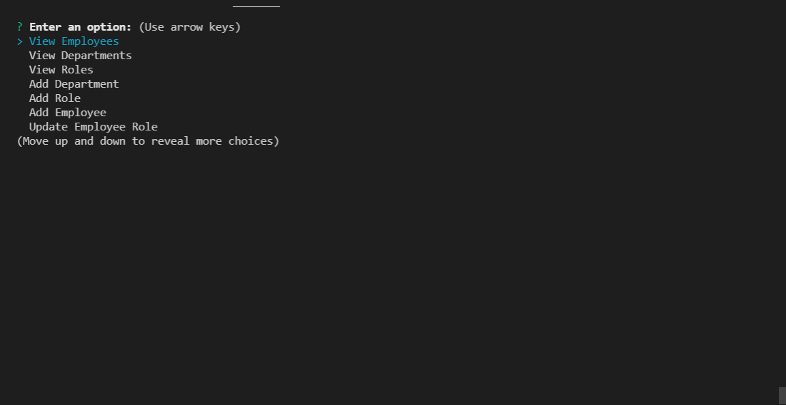
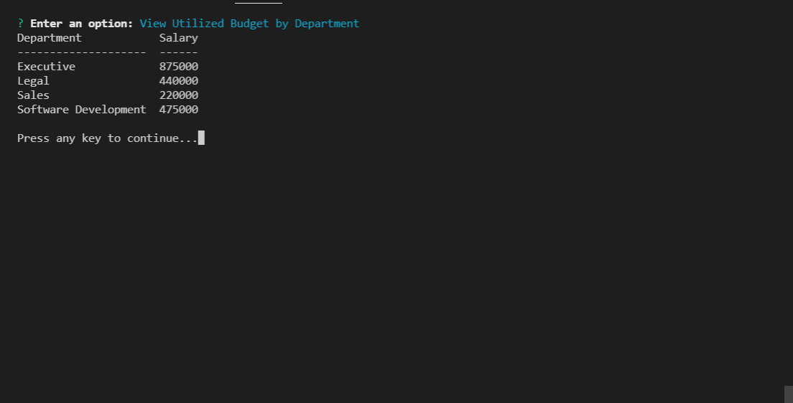
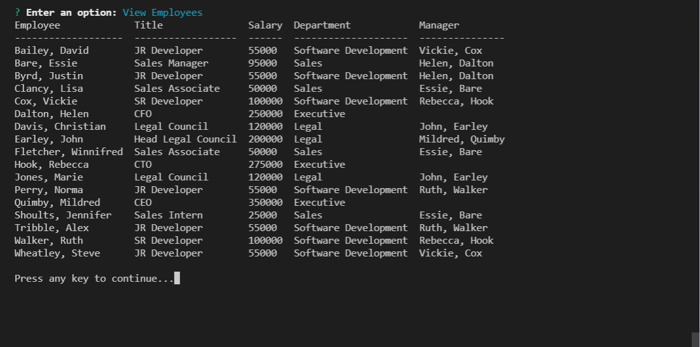

# Employee Tracker
A CLI application to enter and maintain a company's employees, roles and departments.

## Installation/Usage

1. If not already installed, install [git](https://git-scm.com/).
2. If not already installed, install [node.js](https://nodejs.org/).
3. If not already installed, install [mySql](https://www.mysql.com/).
4. Clone the repository to your computer.
5. From the root directory of your repository, connect to mySql and run the below commands:
```
	source ./db/employee-schema.sql;
	source ./db/employee-testdata.sql;
```
6. Create a .env file and edit it to include the below:
```
	DATABASE_HOST=[your mySql host]
	DATABASE_PORT=[your mySql port]
	DATABASE_USERNAME=[your mySql username]
	DATABASE_PASSWORD=[your mySql password]
	DATABASE_NAME=employee_tracker_db
```
7. Install the dependancies by running: npm i
8. Run: `node index.js`

## Screenshots







## Walkthrough

[Walkthrough Video](https://drive.google.com/file/d/1raUqjT57iGGTt3pGCr4Aeu1dhlzTMGso/view?usp=sharing)

## Author

Justin Byrd [email](mailto:justin_byrd@hotmail.com)